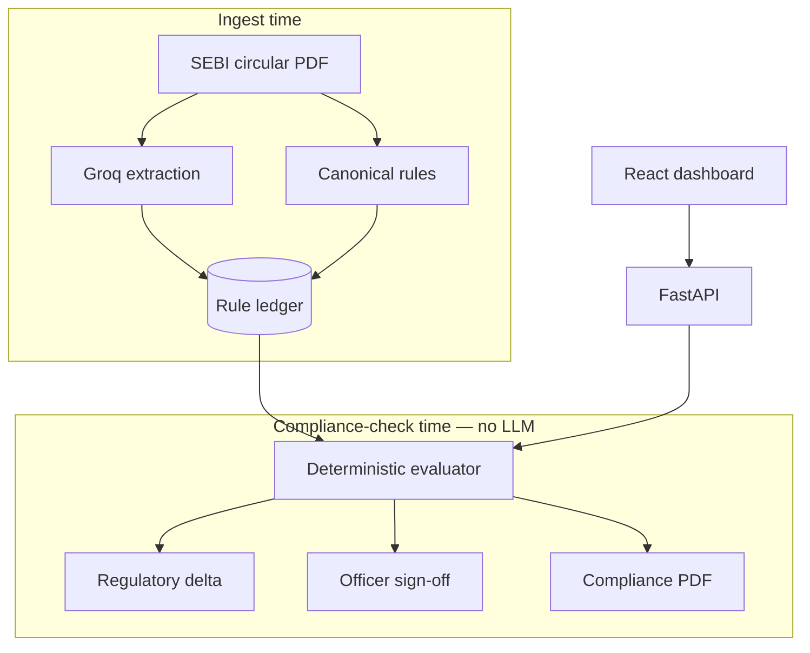

# Nirdesh

**Compliance impact system for SEBI regulatory change.**

When SEBI issues a circular, compliance teams need to know what changed, who must act, and whether they are still compliant before the next CTR or HYTR is due. Nirdesh turns regulatory text into checkable obligations, evaluates them with deterministic code, surfaces amendments as a live delta, requires human sign-off, and exports an auditable compliance report.

> **The LLM extracts. The code decides.**

Built for **Securities Market TechSprint @ GFF 2026** — *Agentic Compliance: From Regulatory Text to Operational Action.*

---

## Live demo

| | URL |
|---|---|
| **Application** | https://nirdesh-frontend.onrender.com |
| **Demo video** | https://www.loom.com/share/09deb6f1327e4b369a357127b95f737c |
| **API** | https://nirdesh-backend.onrender.com |
| **Health** | https://nirdesh-backend.onrender.com/health |

The hosted backend may take 30–60 seconds to wake from sleep on the free tier. Refresh once if the first load fails.

**Workflow tabs:** Circular ingest → Compliance matrix → Regulatory delta → Officer sign-off → Evidence pack (in-app report preview + PDF download).

Interactive API docs: https://nirdesh-backend.onrender.com/docs

### 2-minute demo script

1. **Circular ingest** — upload [`backend/data/circular_MRD-POD3-2026_ORIGINAL.pdf`](backend/data/circular_MRD-POD3-2026_ORIGINAL.pdf). Circular ID is pre-filled for the demo corpus. Show extracted rules, review flags, and QA preview (*Draft — not persisted; matrix uses human-reviewed canonical ruleset*).
2. **Compliance matrix** — as of **01 Sept 2026**: Bharat Growth breach, Meridian compliant, Sentinel N/A. Click a firm for its case file. Optional: Export CSV, Simple/Technical views.
3. **Regulatory delta** — **Apply amendment**. Meridian flips compliant → breach for Phase 2 (§4.4).
4. **Officer sign-off** — Generate tasks → Mark reviewed as **A. Anand**.
5. **Evidence pack** — Refresh preview → Download PDF.

---

## What it does

| Capability | Description |
|---|---|
| **Circular ingest** | Upload PDF or paste text → LLM extracts candidate rules; non-checkable clauses flagged; officer QA preview (demo: matrix uses seeded ruleset). |
| **Rule compilation** | Circular text → structured rules (clause, condition, threshold, deadline). Never invents checkable conditions. |
| **Compliance matrix** | Firms × obligations → **compliant**, **breach**, or **not applicable**, as of any effective date. Firm case files, CSV export, simple/technical views. |
| **Regulatory delta** | When a rule supersedes another, see old vs new and which firms flip **compliant → breach**. |
| **Officer sign-off** | Breaches become review tasks with evidence. A named Compliance Officer must sign off before an obligation is considered actioned. |
| **Evidence pack** | In-app report preview + PDF export with matrix, source citations, delta (if applied), and sign-off log. |
| **Audit trail** | Append-only log with human-readable event details (no raw engine JSON). |

**Governance:** decision-support only. No autonomous filing to SEBI.

---

## Architecture



**Full diagrams** (sequence flow, supersession chain, deployment): see **[docs/ARCHITECTURE.md](docs/ARCHITECTURE.md)**

**Why 2026 / 2027 dates, firms, and source PDF:** see **[docs/DEMO_CORPUS.md](docs/DEMO_CORPUS.md)**

**Official SEBI circular (PDF in repo):** [backend/data/circular_MRD-POD3-2026_ORIGINAL.pdf](backend/data/circular_MRD-POD3-2026_ORIGINAL.pdf)

---

## How it works

```
Circular text  →  LLM extraction (ingest only)  →  Reviewed rule ledger
                                                        ↓
Firm profiles  →  Deterministic evaluator  →  Matrix / Delta / Tasks / PDF
                                                        ↓
                                              Officer sign-off + audit log
```

1. **Ingest** — LLM (Groq) proposes rule objects from PDF/text. The live demo matrix uses a human-reviewed canonical ruleset verified against the official circular PDF.
2. **Evaluate** — Python compares firm data to active rules. No LLM at compliance-check time.
3. **Delta** — Superseded obligations and firm status transitions are computed when an amendment window is applied.
4. **Sign-off** — Review tasks are generated for breaches; officer approval is recorded in the audit trail.
5. **Report** — Evidence pack preview + compliance summary PDF, both logged when exported.

State-changing actions (apply amendment, generate tasks, mark reviewed) are **idempotent** — duplicate clicks do not create duplicate audit noise.

---

## Demo corpus

**Circular:** `HO/47/11/11(1)2026-MRD-POD3/I/13804/2026` (15 Jun 2026) — ETF base price and price bands.

| Deadline | Key change |
|---|---|
| **1 Sep 2026** (§4.1) | Base price moves from T-2 NAV to T-1 closing price (30-min VWAP) |
| **1 Apr 2027** (§4.4) | Base price moves to T-1 closing NAV — supersedes §4.1 |

**Mock AMCs** (fictional demo data):

- **Bharat Growth AMC** — breach on Phase 1 (still on T-2 NAV)
- **Meridian Asset Management** — compliant on Phase 1, **flips to breach** when §4.4 is applied
- **Sentinel Debt Fund** — not applicable (no ETF schemes)

### Screenshots (complete — Jul 2026)

All 12 UI captures are in [`docs/assets/screenshots/`](docs/assets/screenshots/).

| # | View | File |
|---|------|------|
| 1 | Matrix — Simple, Phase 1 | `01-matrix-simple-phase1.png` |
| 2 | Matrix — Technical, Phase 1 | `02-matrix-technical-phase1.png` |
| 3 | Matrix — Phase 2 (Meridian breach) | `03-matrix-phase2.png` |
| 4 | Firm case file — Bharat | `04-firm-casefile-bharat.png` |
| 5 | Rule drawer — condition | `05-rule-drawer.png` |
| 6 | Circular ingest — extracted | `06-ingest-extracted.png` |
| 7 | Regulatory delta — before apply | `07-delta-before-apply.png` |
| 8 | Regulatory delta — after apply | `08-delta-after-apply.png` |
| 9 | Officer sign-off — pending | `09-officer-signoff-pending.png` |
| 10 | Officer sign-off — reviewed | `10-officer-signoff-reviewed.png` |
| 11 | Evidence pack preview | `11-evidence-pack.png` |
| 12 | Audit trail — Review Details | `12-audit-trail-details.png` |

#### Workflow gallery

**Circular ingest**


**Compliance matrix (Phase 1)**


**Firm case file — Bharat Growth AMC**


**Regulatory delta — before / after Apply**


**Officer sign-off**


**Evidence pack**


**Audit trail**


---

## Tech stack

| Layer | Technology |
|---|---|
| Backend | Python 3.11+, FastAPI, SQLAlchemy, SQLite |
| AI (ingest only) | Groq `llama-3.3-70b` — JSON-mode rule extraction |
| Evaluation | Deterministic Python (`evaluate.py`) |
| Frontend | React, TypeScript, Tailwind, Vite |
| Reports | reportlab (PDF) |
| Deploy | Render (static site + web service) |

**Shipped in this build:** PDF upload + paste-text ingest UI, extraction QA preview, firm case files, compliance matrix (simple/technical + CSV export), regulatory delta, officer sign-off, evidence-pack preview + PDF, append-only audit trail.

**Roadmap** (not in current build): PostgreSQL + pgvector for multi-circular retrieval, Celery/Redis for background ingestion, live SEBI RSS monitoring, persistent ingest-to-ledger promotion, deployment hardening, multi-user authentication.

---

## Quick start (local)

**Requirements:** Python 3.11+, Node 18+

```bash
# Clone and run (macOS / Linux / Git-Bash)
git clone https://github.com/ayushanand27/nirdesh.git
cd nirdesh
./run.sh
```

On Windows (Git Bash or WSL), the same `./run.sh` works. Open http://127.0.0.1:5173

**Environment:** copy `backend/.env.example` → `backend/.env`. A Groq API key is optional; the demo runs with a cached extraction and seeded canonical rules.

**Reset database:** `cd backend && python seed_db.py`

---

## API overview

| Endpoint | Purpose |
|---|---|
| `GET /health` | Service status |
| `POST /extract` | Extract rules from pasted circular text |
| `POST /extract-upload` | Extract rules from uploaded PDF |
| `GET /matrix?as_of=` | Compliance matrix (read-only) |
| `POST /evaluate?as_of=` | Record evaluation when outcome changes |
| `GET /delta?from_as_of=&to_as_of=` | Regulatory delta preview or apply |
| `POST /review-tasks/generate` | Create officer review tasks |
| `POST /review-tasks/{id}/review` | Officer sign-off |
| `GET /reports/compliance-summary?format=json\|pdf` | Evidence pack JSON or PDF |
| `GET /audit` | Audit trail |

Full reference: `/docs` on the running backend.

---

## Project structure

```
backend/
  app/              API, extraction, evaluation, delta, sign-off, report
  data/
    circular_MRD-POD3-2026_ORIGINAL.pdf   Official SEBI source PDF
    circular_MRD-POD3-2026_VERIFIED.txt   Verified text extract
    cache/                                LLM extraction cache
frontend/src/     Ingest, matrix, delta, sign-off, evidence pack, audit
docs/             Architecture diagrams, demo corpus, submission notes
render.yaml       Render deployment blueprint
```

**Documentation index:** [docs/README.md](docs/README.md)

---

## Author

**Ayush Anand** — Manipal University Jaipur

**Hackathon:** Securities Market TechSprint @ GFF 2026 — *Agentic Compliance: From Regulatory Text to Operational Action*

---

## Disclaimer

Nirdesh is a **decision-support system**. Compliance results are computed deterministically but require **Compliance Officer verification** before any operational or regulatory action. This software does not file, submit, or remediate anything on behalf of a regulated entity.
