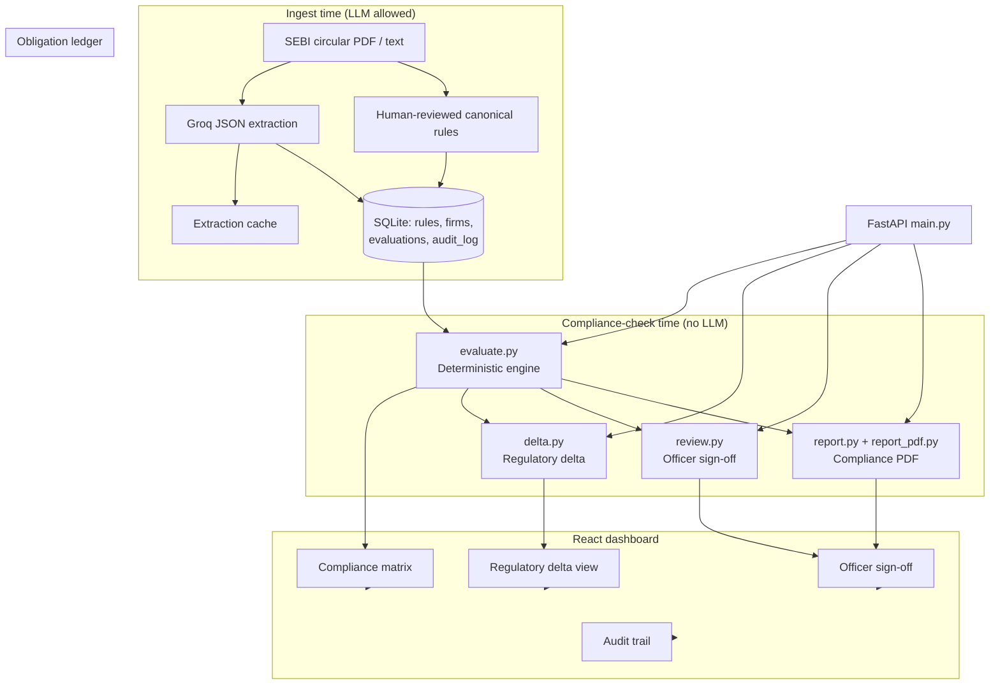
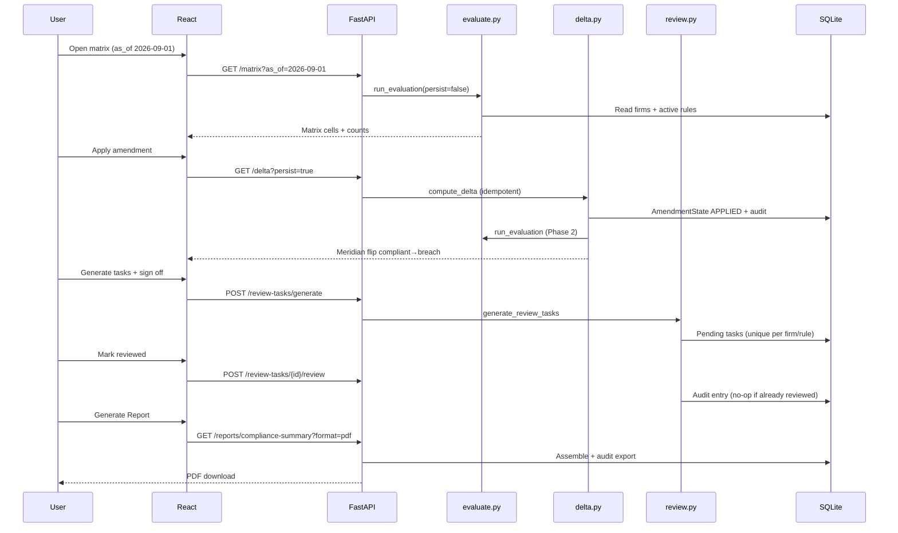
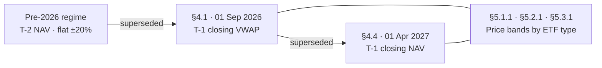
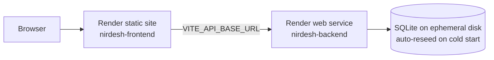

# Architecture

Nirdesh separates **ingest-time AI** from **compliance-check-time deterministic logic**. The LLM may propose rules from circular text; it never decides compliant vs breach.

---

## System overview

---

## Request flow (typical demo path)

---

## Rule supersession chain

One circular, two effective dates. Rules are **append-only**; amendments link via `supersedes_id`.

At **as_of = 2026-09-01**, only rules with `effective_from ≤ date` and not yet superseded by a later-effective rule are active.  
At **as_of = 2027-04-01**, §4.4 replaces §4.1 for base-price checks — this drives the **Meridian flip** in the demo.

---

## Component map

| Module | Role |
|---|---|
| `canonical_rules.py` | Human-verified rule objects (source of truth for demo) |
| `extraction.py` | LLM compile path + cache fallback |
| `evaluate.py` | Deterministic compliant / breach / N/A |
| `delta.py` | Old vs new obligation diff + firm transitions |
| `review.py` | Review tasks + officer sign-off |
| `report.py` / `report_pdf.py` | JSON report assembly + PDF export |
| `models.py` | ORM: rules, firms, evaluations, audit_log, amendment_state |
| `audit_hygiene.py` | Startup dedupe + schema extras |
| `App.tsx` + views | Matrix, Delta, Sign-off, Audit panel |

---

## Idempotency & audit integrity

| Action | Behaviour on repeat |
|---|---|
| Apply amendment | No-op if already `APPLIED` — no second amendment audit |
| Generate tasks | Skips existing pending/reviewed for same firm+rule+as_of |
| Mark reviewed | No-op if already reviewed |
| Record evaluation | No audit if fingerprint unchanged |
| Generate report | Each download logs one export event (intentional accountability) |

---

## Deployment

See `render.yaml` for the blueprint. Production roadmap: Postgres with persistent volume.
