# Nirdesh — Final PPT brief (copy everything below into Kimi K2)

**Purpose:** Recreate / refine the hackathon deck to match the live prototype.  
**Live app:** https://nirdesh-frontend.onrender.com  
**GitHub:** https://github.com/ayushanand27/nirdesh  
**Screenshots folder (local):** `docs/assets/screenshots/`  
**Screenshot URLs (for image upload):**  
`https://raw.githubusercontent.com/ayushanand27/nirdesh/main/docs/assets/screenshots/<filename>.png`

---

## KIMI K2 PROMPT (paste this first)

```
You are refining a 12-slide hackathon pitch deck for "Nirdesh" — a SEBI compliance impact system.

RULES:
- Dark institutional theme (navy/black + gold accents) — match the screenshots
- 12 slides max. One core idea per slide.
- Put "Decision-support only — no autonomous filing to SEBI" ONLY on slide 1 (small) and slide 12 (closing). Remove from all other slides.
- Use the exact firm names: Bharat Growth AMC, Meridian Asset Management, Sentinel Debt Fund. NEVER use Alpha, Pinnacle, or fictional names from old deck.
- Use real clause IDs: §4.1, §4.4, §5.1.1, §5.2.1, §5.3.1
- Tagline on title slide: "The LLM extracts. The code decides."
- Insert the screenshots listed per slide (upload the PNG files I provide, or use the GitHub raw URLs).
- Keep text minimal on screenshot slides — let the UI speak.
- Speaker notes: 1–2 sentences per slide for a 2–3 min live demo pitch.

OUTPUT: Slide-by-slide title, body bullets, which screenshot goes where, and speaker notes.
```

---

## DECK MAP (12 slides)

| # | Slide title | Screenshot(s) |
|---|-------------|---------------|
| 1 | Title | — |
| 2 | The Problem | — |
| 3 | Real Stakes | — |
| 4 | Solution | `05-rule-drawer.png` (small, optional) |
| 5 | Demo Scenario | `03-matrix-phase2.png` (small corner) |
| 6 | Live Demo — Circular Ingest | `06-ingest-extracted.png` |
| 7 | Live Demo — Compliance Matrix | `01-matrix-simple-phase1.png` + `04-firm-casefile-bharat.png` |
| 8 | Regulatory Delta | `07-delta-before-apply.png` + `08-delta-after-apply.png` |
| 9 | Officer Sign-off | `09-officer-signoff-pending.png` + `10-officer-signoff-reviewed.png` |
| 10 | Evidence Pack + Audit | `11-evidence-pack.png` + `12-audit-trail-details.png` |
| 11 | Why Not a Chatbot | — |
| 12 | Technology + Ask | — |

---

## ALL SCREENSHOTS (embed / upload these)

### 01 — Matrix Simple Phase 1
**File:** `01-matrix-simple-phase1.png`  
**Slide:** 7 (main)

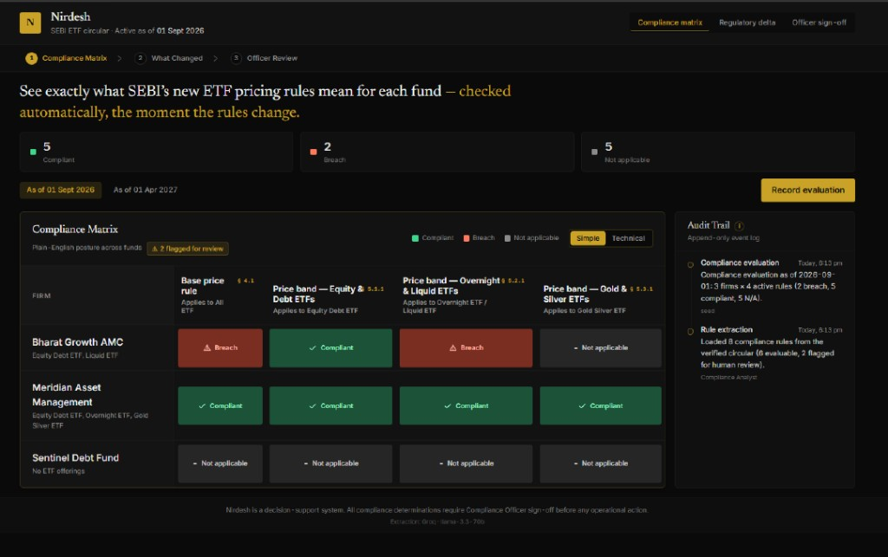

---

### 02 — Matrix Technical Phase 1 (appendix / backup)
**File:** `02-matrix-technical-phase1.png`  
**Slide:** optional appendix only

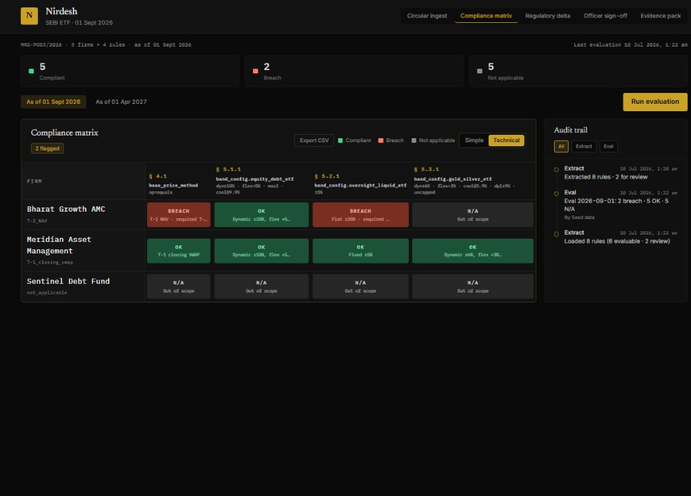

---

### 03 — Matrix Phase 2 (Meridian breach)
**File:** `03-matrix-phase2.png`  
**Slide:** 5 (small corner)

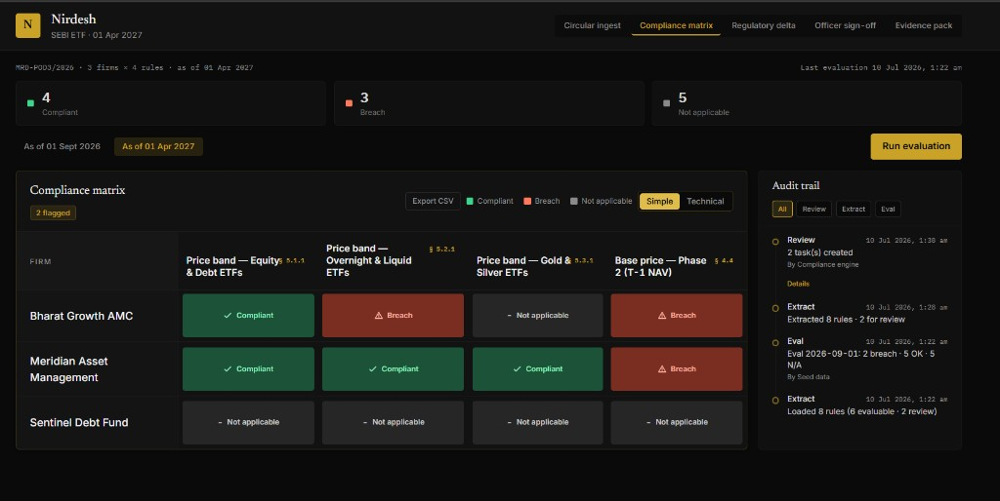

---

### 04 — Firm case file (Bharat)
**File:** `04-firm-casefile-bharat.png`  
**Slide:** 7 (inset / right panel)

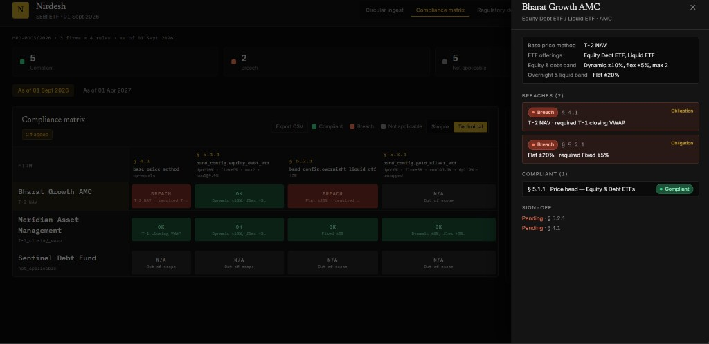

---

### 05 — Rule drawer
**File:** `05-rule-drawer.png`  
**Slide:** 4 (optional small)

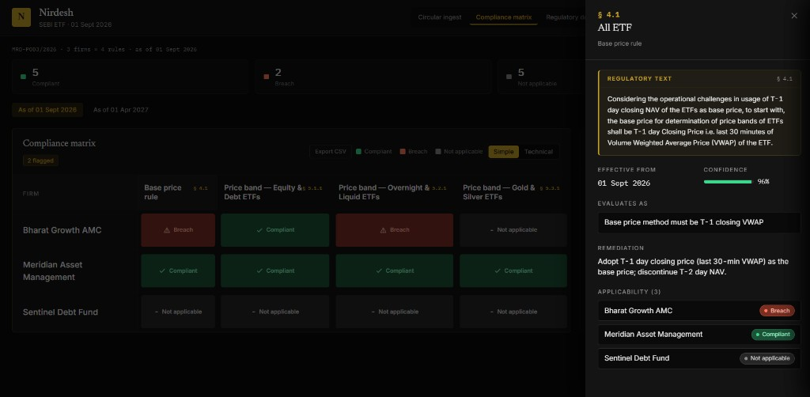

---

### 06 — Circular ingest
**File:** `06-ingest-extracted.png`  
**Slide:** 6 (large, hero)

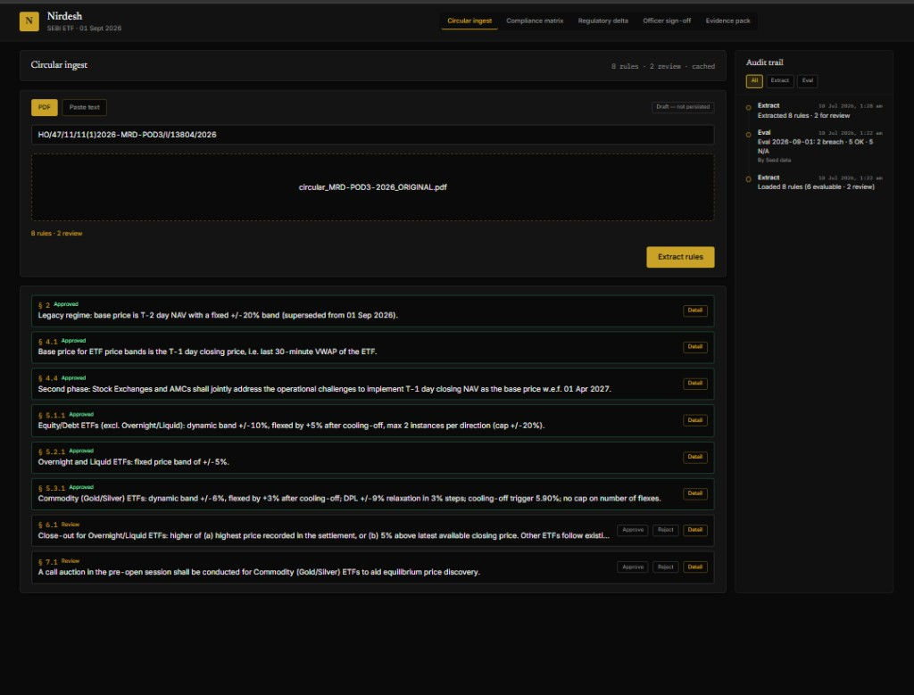

---

### 14 — Ingest QA (optional inset on slide 6)
**File:** `14-ingest-qa.png`

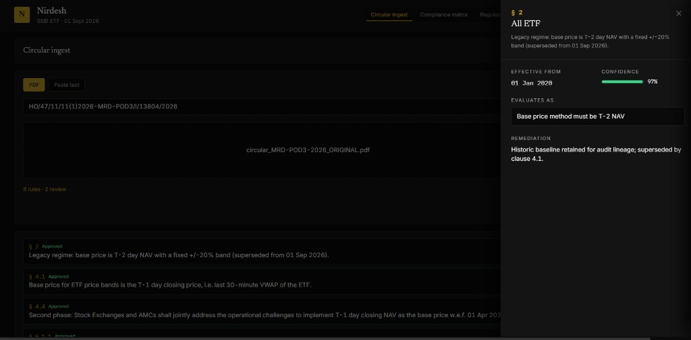

---

### 07 — Delta before apply
**File:** `07-delta-before-apply.png`  
**Slide:** 8 (left panel)

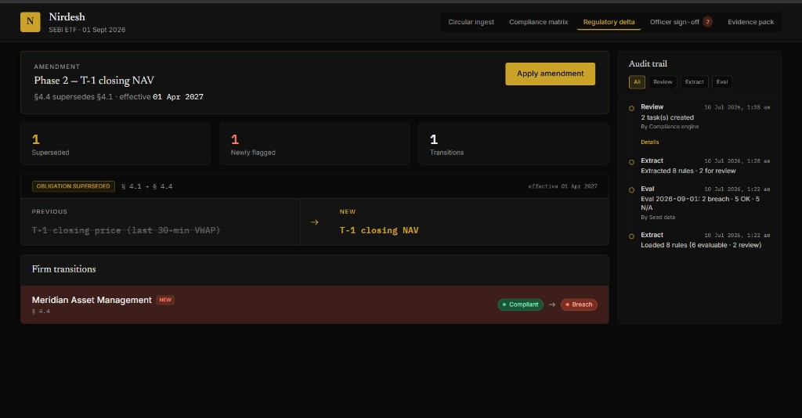

---

### 08 — Delta after apply
**File:** `08-delta-after-apply.png`  
**Slide:** 8 (right panel)

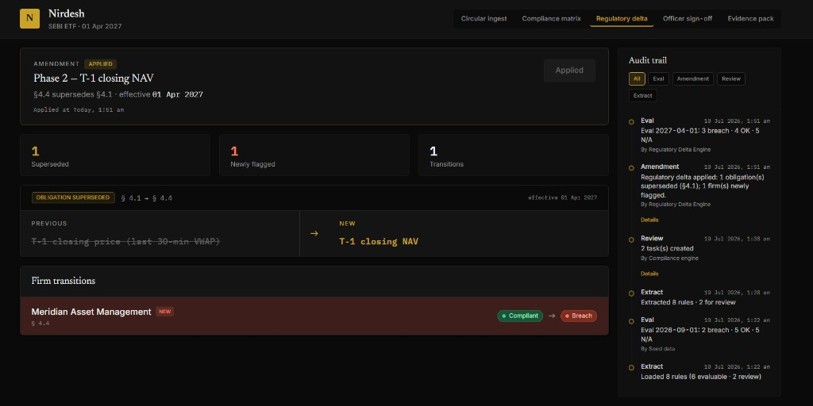

---

### 09 — Sign-off pending
**File:** `09-officer-signoff-pending.png`  
**Slide:** 9 (left / before)

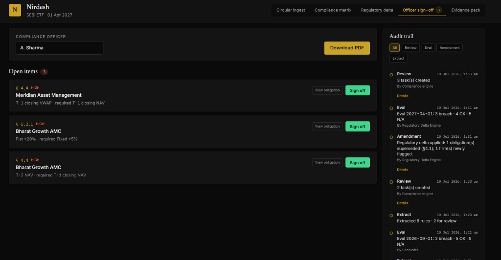

---

### 10 — Sign-off reviewed
**File:** `10-officer-signoff-reviewed.png`  
**Slide:** 9 (right / after)

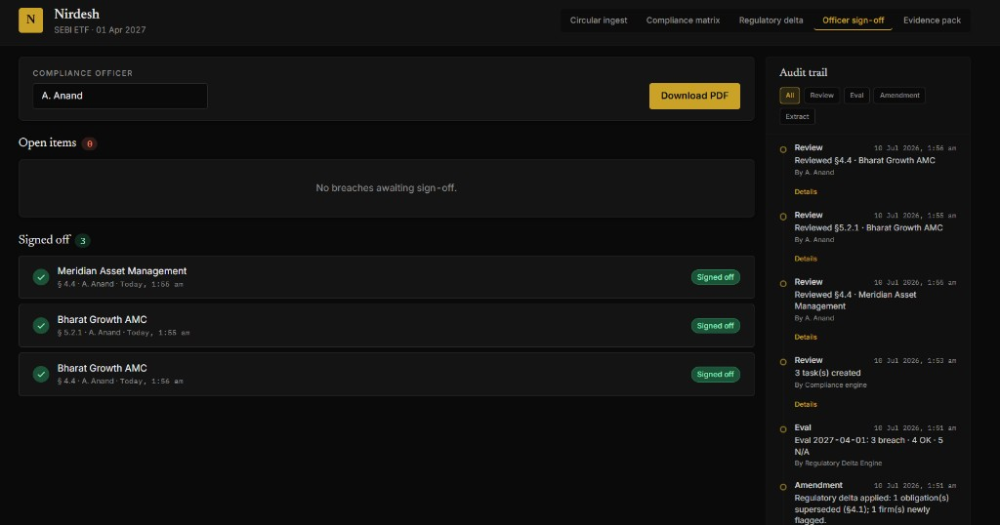

---

### 11 — Evidence pack
**File:** `11-evidence-pack.png`  
**Slide:** 10 (main)

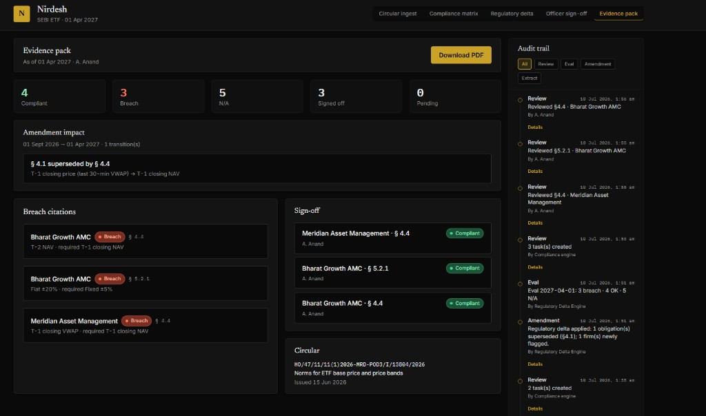

---

### 12 — Audit trail Details
**File:** `12-audit-trail-details.png`  
**Slide:** 10 (inset)

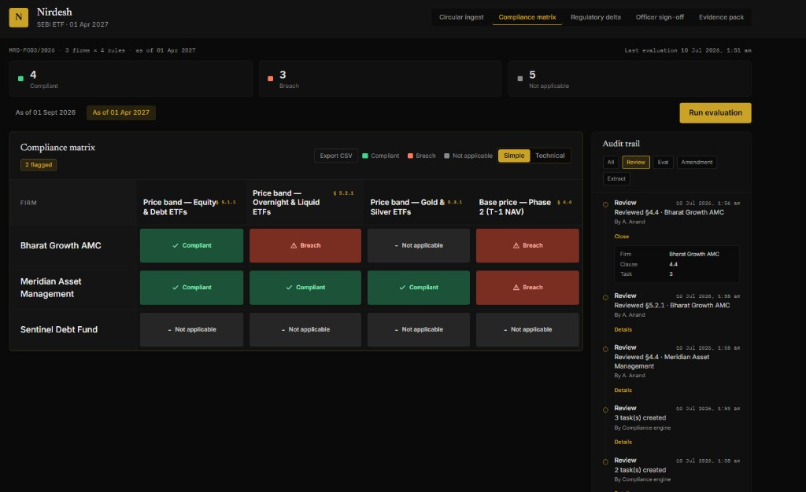

---

# SLIDE-BY-SLIDE CONTENT (full copy for each slide)

---

## SLIDE 1 — Title

**Title:** Nirdesh

**Subtitle:** The LLM extracts. The code decides.

**Body:**
- Compliance Impact System for SEBI Regulatory Change
- Agentic Compliance: From Regulatory Text to Operational Action
- Ayush Anand · Manipal University Jaipur
- Securities Market TechSprint @ GFF 2026

**Links (bottom):**
- nirdesh-frontend.onrender.com
- github.com/ayushanand27/nirdesh

**Small line:** LIVE PROTOTYPE · DECISION-SUPPORT ONLY

**Screenshot:** none

**Speaker note:** "Nirdesh turns SEBI circulars into checkable obligations — LLM at ingest, deterministic code at compliance-check time, human sign-off before anything is actioned."

---

## SLIDE 2 — The Problem

**Title:** When SEBI issues a circular, compliance teams ask three questions

**Body:**
1. **What changed** — for us, specifically?
2. **Who must act** — and by when?
3. **Are we still compliant** — before CTR / HYTR?

**Bottom line:** Today: PDFs in email, spreadsheets, manual interpretation. **Weeks of lag** between publication and operational clarity.

**Screenshot:** none

**Speaker note:** "Compliance isn't a chat problem — it's an obligation-tracking problem with hard deadlines."

---

## SLIDE 3 — Real Stakes

**Title:** Threshold rules are machine-checkable. Waiting weeks is liability.

**Body:**
- Late-2024 SEBI enforcement: AMC + CEO personally fined
- A focused fund breached a **30-stock limit across 88 trading days**
- Numeric rules can be checked in code — interpretation lag cannot be excused
- Compliance teams need a **ledger**, not another PDF summary

**Screenshot:** none

**Speaker note:** "This is why we built deterministic evaluation — same inputs, same outputs, auditable."

---

## SLIDE 4 — Solution

**Title:** Solution: Ingest → Evaluate → Act → Report

**Body:**

| Step | What |
|------|------|
| **0 Ingest** | PDF → LLM extraction · review flags · officer QA preview |
| **1 Compile** | Clause · condition · threshold · deadline (never guessed) |
| **2 Evaluate** | Deterministic Python · compliant / breach / N/A · firm case files |
| **3 Act** | Breach → review tasks · named Compliance Officer sign-off |
| **4 Report** | Evidence pack preview + PDF · append-only audit trail |

**Principle (highlight):** The LLM extracts. The code decides.

**Screenshot:** `05-rule-drawer.png` (small — shows Field / Check / Required, not code dump)

**Speaker note:** "LLM only proposes structure at ingest. Every breach decision is Python comparing firm profile to rule condition."

---

## SLIDE 5 — Demo Scenario

**Title:** One circular · two compliance clocks

**Circular:** MRD-POD3/2026 — ETF base price & price bands  
**ID:** HO/47/11/11(1)2026-MRD-POD3/I/13804/2026 · Issued 15 Jun 2026

**Table:**

| Firm | Phase 1 (01 Sep 2026) | Phase 2 (01 Apr 2027) |
|------|----------------------|----------------------|
| **Bharat Growth AMC** | Breach (still on T-2 NAV) | Breach |
| **Meridian Asset Management** | Compliant (T-1 VWAP) | **Breach** (needs T-1 NAV) |
| **Sentinel Debt Fund** | N/A (no ETF schemes) | N/A |

**Phases:**
- Phase 1: §4.1 — base price moves to T-1 closing VWAP
- Phase 2: §4.4 — T-1 closing NAV **supersedes** §4.1

**Screenshot:** `03-matrix-phase2.png` (small — Meridian Breach on §4.4)

**Speaker note:** "Meridian is the punchline — compliant on Sept 1, flips to breach when the April 2027 amendment activates."

---

## SLIDE 6 — Live Demo: Circular Ingest

**Title:** Live Demo — Circular Ingest

**Bullets:**
- Upload official SEBI PDF (`circular_MRD-POD3-2026_ORIGINAL.pdf`)
- 8 rules extracted · 2 flagged for human review (§6.1, §7.1)
- Officer can Approve / Reject ambiguous clauses
- **Draft — not persisted** — matrix uses human-reviewed canonical ruleset

**Screenshot:** `06-ingest-extracted.png` (LARGE — main visual)  
**Optional inset:** `14-ingest-qa.png`

**Speaker note:** "Ingest is live — PDF parse + extraction. Matrix uses verified ruleset because compliance decisions must not depend on LLM output."

---

## SLIDE 7 — Live Demo: Compliance Matrix

**Title:** Live Demo — Compliance Matrix

**Caption:** 01 Sep 2026 · Bharat breach · Meridian compliant · Sentinel N/A

**Bullets:**
- Firms × obligations → compliant / breach / not applicable
- Click firm → case file (profile + breach evidence)
- Simple / Technical views · CSV export
- **No LLM at check time** — deterministic Python engine

**Screenshots:**
- Main: `01-matrix-simple-phase1.png`
- Inset: `04-firm-casefile-bharat.png`

**Speaker note:** "Bharat still on T-2 NAV and flat ±20% liquid band — two breaches. Meridian fully compliant under Phase 1 rules."

---

## SLIDE 8 — Regulatory Delta

**Title:** Regulatory Delta — what changed when the rule changed

**Subtitle:** One circular · two deadlines · Meridian flips when §4.4 supersedes §4.1

**Bullets:**
- **Before:** §4.1 active — T-1 closing VWAP as base price
- **Previous obligation struck through** → **new obligation highlighted** (industry redline pattern)
- **After Apply:** Meridian compliant → breach · amendment logged in audit trail
- Idempotent — duplicate Apply does not create audit noise

**Screenshots (side by side):**
- Left: `07-delta-before-apply.png`
- Right: `08-delta-after-apply.png`

**Speaker note:** "This is what CTR signers need — not just a static matrix, but the delta when regulations phase in."

---

## SLIDE 9 — Officer Sign-off

**Title:** Human in the loop — breaches become review tasks

**Bullets:**
- Compliance engine generates tasks from breaches
- Named officer must sign off (demo: **A. Anand**)
- Plain-English breach lines: "T-2 NAV · required T-1 closing NAV"
- Idempotent — no duplicate audit entries on re-click

**Screenshots (before → after):**
- `09-officer-signoff-pending.png`
- `10-officer-signoff-reviewed.png`

**Speaker note:** "Nothing is auto-filed to SEBI. Officer reviews evidence, then signs off. Audit trail records who, what, when."

---

## SLIDE 10 — Evidence Pack + Audit Trail

**Title:** Evidence pack — exportable compliance summary

**Bullets:**
- In-app preview: matrix metrics · breach citations · amendment impact · sign-off log
- **Download PDF** — reportlab-generated compliance summary
- Append-only audit trail — Review/Amendment Details expandable
- Eval events show outcome in message line (industry-standard audit format)

**Screenshots:**
- Main: `11-evidence-pack.png`
- Inset: `12-audit-trail-details.png`

**Speaker note:** "This is what you'd attach to a CTR readiness review — not a chat transcript."

---

## SLIDE 11 — Why Not a Chatbot?

**Title:** Why not a chatbot over the PDF?

**Table:**

| | Generic RAG / Chatbot | **Nirdesh** |
|---|----------------------|-------------|
| Output | Free-text answer | Structured obligation ledger |
| Compliance call | LLM guesses | **Deterministic code** |
| Rule change | Re-ask the bot | **Regulatory delta** (old vs new) |
| Evidence | Chat log | **Exportable PDF + audit trail** |
| Filing risk | Hallucination | **Decision-support only** |

**Screenshot:** none

**Speaker note:** "Chatbots answer questions. Nirdesh tracks obligations across time and tells you who flipped when the rule changed."

---

## SLIDE 12 — Technology + Ask

**Title:** Built · Deployed · Ready to pilot

**SHIPPED:**
```
Backend      Python · FastAPI · SQLAlchemy · SQLite
AI (ingest)  Groq llama-3.3-70b — extraction only
Evaluation   Deterministic Python — no LLM at check time
Frontend     React · TypeScript · Tailwind — 5 workflow tabs
Export       reportlab PDF + matrix CSV
Deploy       Render (live) · GitHub public repo
```

**ROADMAP (do not claim as shipped):**
PostgreSQL + pgvector · Celery/Redis · SEBI RSS · ingest→ledger promotion · SSO

**Business:** B2B SaaS for AMCs / brokers — subscription by AUM or entity count

**Ask:**
- Sandbox access with SEBI / industry data
- Mentorship on production hardening
- Pilot with one AMC

**Links:**
- nirdesh-frontend.onrender.com
- github.com/ayushanand27/nirdesh
- [Loom demo URL — add before upload]

**Closing (once):** Decision-support only — no autonomous filing to SEBI

**Screenshot:** none

**Speaker note:** "Live prototype deployed. Looking for a pilot partner and guidance on production path."

---

# DELETE FROM OLD DECK

| Remove | Replace with |
|--------|--------------|
| Alpha Mutual Fund / Pinnacle Broking | Bharat / Meridian / Sentinel |
| clause_3.2, §2.1 | §4.1, §4.4, §5.1.1, §5.2.1, §5.3.1 |
| Celery, pgvector, SEBI RSS as "shipped" | Move to Roadmap slide only |
| Footer disclaimer on every slide | Title + slide 12 only |
| Raw JSON audit screenshots | `12-audit-trail-details.png` |
| Old files: `03-delta-before-apply`, `04-delta-meridian-flip`, `05-officer-signoff` | Use `07`, `08`, `09`+`10` |

---

# 2-MIN LOOM SCRIPT (for demo video)

| Time | Tab | Say |
|------|-----|-----|
| 0:00 | Ingest | Upload PDF → 8 rules, 2 need review. Draft only — matrix uses verified ruleset. |
| 0:25 | Matrix Phase 1 | Sept 2026. Bharat breach, Meridian OK. Open firm case file. |
| 0:55 | Delta | Apply amendment — §4.4 supersedes §4.1. Meridian flips. |
| 1:25 | Sign-off | Generate tasks → officer signs off all breaches. |
| 1:50 | Evidence | Preview + Download PDF. |
| 2:10 | Audit | Review Details in audit trail. |
| 2:25 | Title | Nirdesh — LLM extracts, code decides. Live link. |

---

# UPLOAD CHECKLIST

- [ ] Paste this doc (or Kimi output) into PowerPoint / Google Slides
- [ ] Insert all 12 screenshots from `docs/assets/screenshots/`
- [ ] Compress images if PPT > 10 MB
- [ ] Record Loom (under 3 min) using script above
- [ ] Upload PPT + Loom URL to HackCulture form
- [ ] Re-save form: https://nirdesh-frontend.onrender.com still loads after cold start
